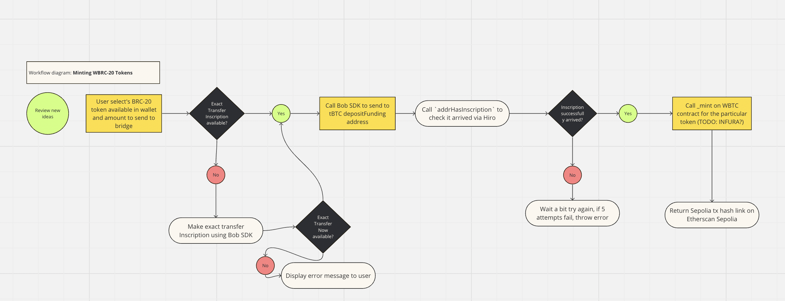
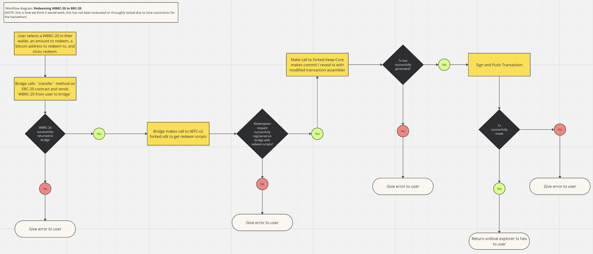

### Submission for BOB hackathon -- BRC-20 -> ERC-20 Bridge via tBTC and BOB

[**Powerpoint**](https://docs.google.com/presentation/d/1occTT87HjdzhbSLNFYLNFwNGM34UxBbPFwLQpCx4_5g/edit?usp=sharing)  
[**POC Video**](https://drive.google.com/file/d/1-hzHSQm5iUp0w41QsiYjIPNsxALE83xr/view?usp=sharing)

**Bounties we are submitting for**
```
1. Build on BOB.  
2. Design a proof of concept for ordinals/brc20 working on tbtc.  
3. Bonus for challenges and prizes completions that integrate BOB.  
```

**Team**
```
[Rashad Haddad -- Backend](https://github.com/rashadalh/tBTC-Bridge-MonoRepo)  
[Eric Nans -- frontend](https://github.com/EcosystemNetwork)  
```

**Tools used**
```
1. Bob SDK (making / sending inscriptions)  
2. Bob SDK (relay to prove BTC deposited from ETH)  
3. tBTC bridge (to hold inscriptions, and generate redemption inscriptions)  
4. Keep-Core (some modifications to be able to do inscriptions)  
```

**BRC-20 --> WBRC-20 (a ERC-20 token)**
1. Use the **bob sdk** to create and send transfer inscriptions to the tBTC minting address, along with a small amount of BTC
2. mint the tBTC
3. Once we verify that the bridge contract on ethereum holds the tbc, AND the transfer inscription was sucessfully made to the tBTC bridge, mint an ERC-20 to the user.

**WBRC-20 --> BRC-20**
This is a bit harder, and requires some experimental forks to the sdk from threshold network `tBTC-v2` to get it to produce commit/reveal scripts AND an expiremental fork to keep-core to allow the `assembleRedemption` method to accept commit/reveal scripts and build P2SH/P2WPKH type transactions in go. These methods have NOT been throughly tested, and should be used with extreme precaution. The idea is as follows:   
1. User comes to bridge website, and signs a tx that transfers the WBRC-20 (a ERC-20 token) back to the bridge on Ethereum Sepolia, along with a small amount of tBTC.    
2.  The bridge then registers a redemption request with the tBTC bridge via the sdk with the users, bitcoin address. It calls a modified version of the `requestRedemption` method to get back commit/redeem scripts programmed with the pubkey of the wallet holding the bitcoin.    
3. A call is made to the forked version of keep-core's `assembleRedemptionWithRevealTransaction` method with the scripts. First a tx is made to fund a P2SH/P2WPKH, then a tx is made to spend the derived address to the users address. This *should* make an inscription directly to the user's bitcoin address  


Hello there! We are attempting to solve the briding problem from BRC-20 to ERC-20. To do this,
we are attempting to use the tBTC bridge. The idea is as follows:

**BRC-20 --> WBRC-20 (a ERC-20 token)**
1. Use the **bob sdk** to create and send transfer inscriptions to the tBTC minting address, along with a small amount of BTC
2. mint the tBTC
3. Once we verify that the bridge contract on ethereum holds the tbc, AND the transfer inscription was sucessfully made to the tBTC bridge, mint an ERC-20 to the user.

**WBRC-20 --> BRC-20**
This is a bit harder, and requires some expirmental forks to the sdk from threshold network `tBTC-v2` to get it to produce commit/reveal scripts AND an expiremental fork to keep-core to allow the `assembleRedemption` method to accept commit/reveal scripts and build P2SH/P2WPKH type transactions in go. These methods have NOT been throughly tested, and should be used with extreme precaution. The idea is as follows:   
1. User comes to bridge website, and signs a tx that transfers the WBRC-20 (a ERC-20 token) back to the bridge on Ethereum Sepolia, along with a small amount of tBTC.    
2.  The bridge then registers a redemption request with the tBTC bridge via the sdk with the users, bitcoin address. It calls a modified version of the `requestRedemption` method to get back commit/redeem scripts programmed with the pubkey of the wallet holding the bitcoin.    
3. A call is made to the forked version of keep-core's `assembleRedemptionWithRevealTransaction` method with the scripts. First a tx is made to fund a P2SH/P2WPKH, then a tx is made to spend the derived address to the users address. This *should* make an inscription directly to the user's bitcoin address  


**Mint WBRC-20 FlowChart**
[](https://miro.com/app/live-embed/uXjVNn4_4Ek=/?moveToViewport=-1828,-1332,3717,1854&embedId=182865534281)
https://miro.com/app/board/uXjVNn4_4Ek=/?share_link_id=398445790230


**Redeem WBRC-20 FlowChart**
[](https://miro.com/app/live-embed/uXjVNn4_4Ek=/?moveToViewport=-1828,-1332,3717,1854&embedId=182865534281)  

https://miro.com/app/board/uXjVNn_vsfM=/?share_link_id=829265251956   


To deploy contracts to sepolia the following guide was followed:  
https://book.getfoundry.sh/forge/deploying   


### Forks explained...
We think that there may need to be some modifications to the tBTC bridge, and keep-core to make this possible.
At a high level we need to be able to:
(1) Get the tBTC redemption function to return commit/reveal scripts and 
(2) Get the keep-core node to make and send a transaction that funds a P2SH/P2WPKH address and then sends a reveal transaction.

**To achieve (1)**, we propose the following fork: [Fork of tBTC-v2](https://github.com/rashadalh/tbtc-v2-reedemOnRedeem)

This fork modifies `tbtc-v2/typescript/src/services/redemptions/redemptions-service.ts` specifically [`requestRedeemption`](https://github.com/rashadalh/tbtc-v2-reedemOnRedeem/blob/b47d63363e4d3edfa59098f9c144d959d3554151/typescript/src/services/redemptions/redemptions-service.ts#L50) to return commit/reveal scripts built using bitcoinjs-lib. In particular, without brekaing the bridge's ability to request a register a redemption tx, we also return a commit script programmed with the public key for the redemption for keep-core to add it's signature to and a revela script to actually make the inscriptions.

In addition we also add the modules:
(a) `tbtc-v2/typescript/src/services/redeemScripts/makeBRC20.ts`  
(b) `tbtc-v2/typescript/src/services/redeemScripts/makeInscriptionScript.ts`  

Which provide methods to make BRC20 tokens and Inscriptions respectively.

**To achieve (2)**, we attempted the following fork:  [keep-core with redeem scripts in builder](https://github.com/rashadalh/keep-core-addsRedeemScripts). 

This fork adds an additional function [`assembleRedemptionWithRevealTransaction`](https://github.com/rashadalh/keep-core-addsRedeemScripts/blob/2a76f4de820eb13b2d49c67a15a59eac7552fa26/pkg/tbtc/redemption.go#L378) `keep-core/pkg/tbtc/redemption.go`  

Effectively this alllows you to build a transaction with commit/reveal scripts as an argument, and additionally pass an argument for whether this will be a P2SH / P2WPKH type of transaction.  

Unforuntately we did not have time to adequately test how to properly deploy the keep-core network with these modifications to actually make the inscriptions on chain from the bridge. Although **we can indeed return commit/reveal scripts from the forked tBTC sdk, during the scope and constraints of the hackathon we were not able to fully integrate unbridging. This is left as a to do for further development**


### Testing Code...  

**To begin, please sync and update all submodules! You can do this by running**    
```
git submodule sync --recursive   
git submodule update --init --recursive   
```

**To install typescript dependencies:**
```
1. Update submodules -- git submodule --update init (this will sync forked repos)  
2. Run npm install to install node modules for typescript  
```

**To Install Solidity**
```
1. cd Solidity
2. cd bob-starter-kit
3. Forge Build
4. (Optional) Forge Test
5. To Deploy: forge create --rpc-url <your_rpc_url> --private-key <your_private_key> script/deploy_wbrc20.sol:DeployWBRC20  
```

**To demo the frontend for POC**
```
1. cd into frontend/app
2. Install pnpm package manager - https://pnpm.io/installation
3. Install dependencies: pnpm i
4. Run app (automatically opens default browser): pnpm run dev
5. Connect to metamask flask  
```
