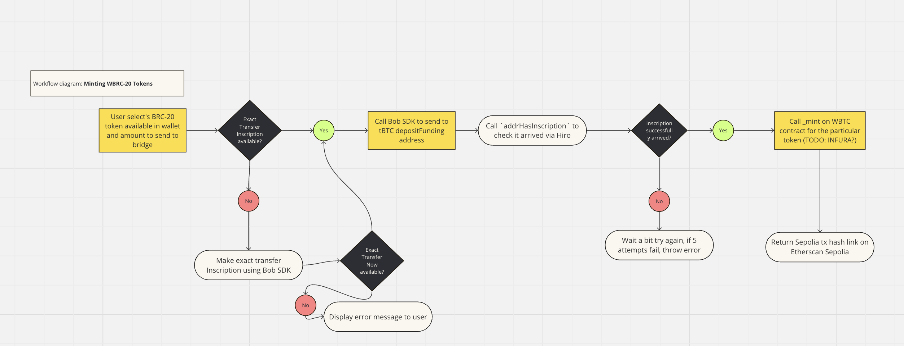

### Submission for BOB hackathon tackling bounty #3 -- bridge BRC-20 to ETH using tBTC bridge


**Mint WBRC-20 FlowChart**
[](https://miro.com/app/live-embed/uXjVNn4_4Ek=/?moveToViewport=-1828,-1332,3717,1854&embedId=182865534281)


To install  
```
1. Update submodules -- git submodule --update init (this will sync forked repos)
2. Run npm install to install node modules for typescript
3. Foundry -- If not installed run curl -L https://foundry.paradigm.xyz | bash, follow instructions
4. TODO -- SOLIDITY INSTRUCTION FOR LOCAL TESTING WITH HARDHAT
```

To run
```
...
```